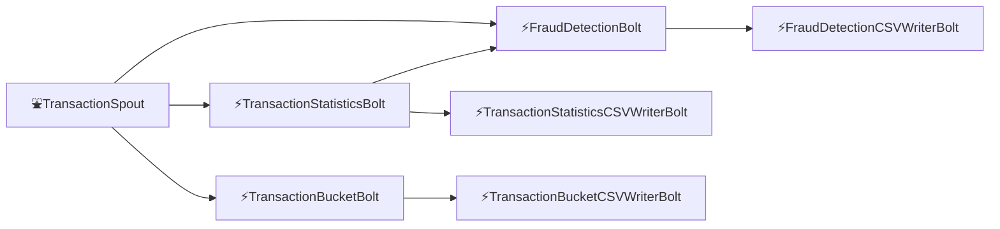

# Apache Storm Example

## Compile and run

```shell
mvn compile exec:java
```

## Visulization of topology


```mermaid
graph LR
    A[⛲TransactionSpout] --> B[⚡TransactionStatisticsBolt]
    A --> C[⚡FraudDetectionBolt]
    A --> F[⚡TransactionBucketBolt]
    B --> D[⚡TransactionStatisticsCSVWriterBolt]
    B --> C
    C --> E[⚡FraudDetectionCSVWriterBolt]
    F --> G[⚡TransactionBucketCSVWriterBolt]
```
